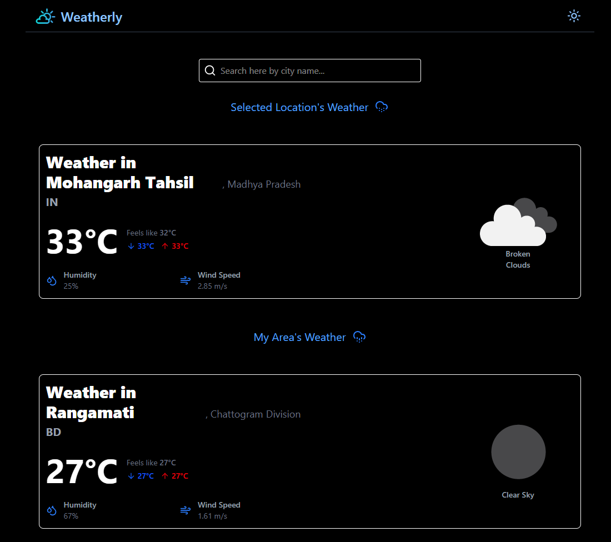
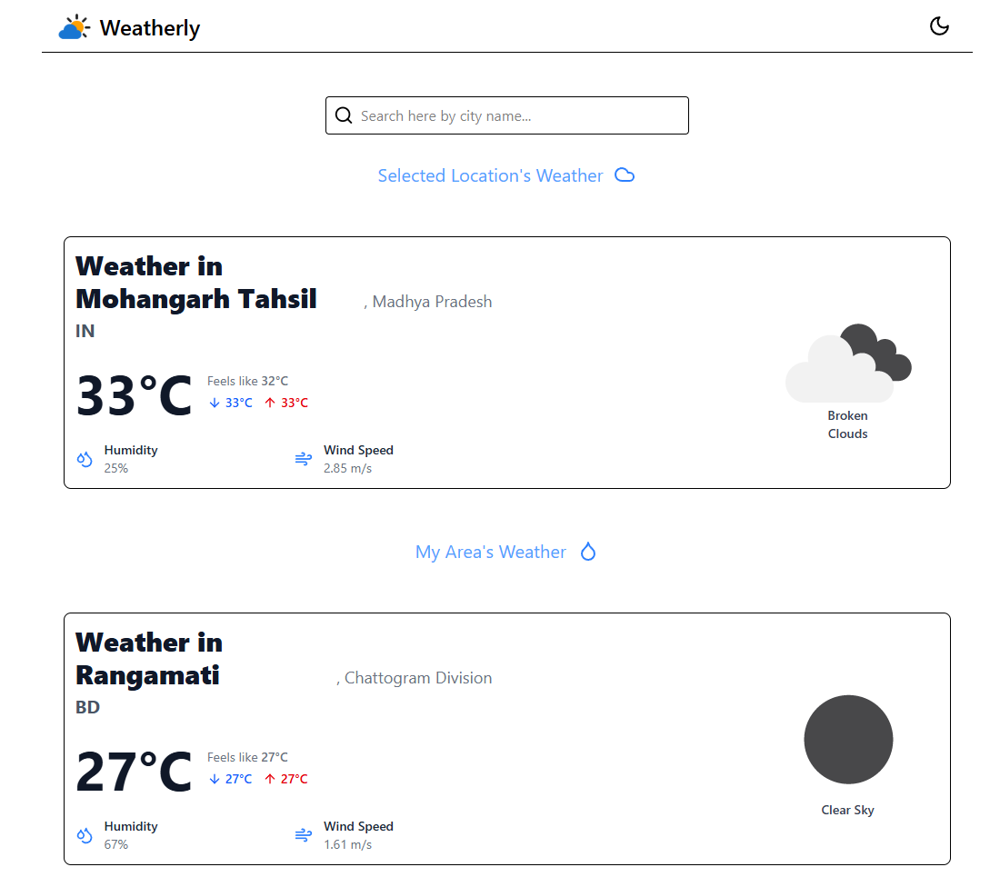

# 🌤️ Weather App

A fully responsive and fast Weather App built with modern web technologies, providing real-time weather information with enhanced user experience.

## 🚀 Features

* 🔍 **City-based Search** — Search weather by city name with live suggestions.
* 📜 **Search History** — Persists your last 5 searched cities using `localStorage`.
* ⚡ **Real-Time API Integration** — Fetches live weather data using [OpenWeatherMap](https://openweathermap.org/).
* 🌀 **Loading States** — Gracefully handles data fetching with custom loaders.
* 🚫 **Error Handling** — Displays user-friendly error messages for data issues.
* 🌘 **Dark Mode Support** — Seamless dark mode experience.
* 🎨 **Visual Enhancements** — Utilizes icons and interactive UI components for better UX.
* 🧠 **State Management** — Global state is managed using **Redux Toolkit**.
* 📡 **Data Fetching** — Uses **RTK Query** for efficient, and cached data fetching.
* 📱 **Responsive Design** — Fully responsive layout, optimized for mobile, tablet, and desktop.
* 🌪️ **Fast UI with Tailwind CSS** — Styled using **Tailwind CSS** for utility-first, fast, and maintainable design.
* 🧾 **Typed Codebase** — Built entirely with **TypeScript** for type safety and scalability.

## 🛠️ Tech Stack

* **React** 
* **Redux Toolkit + RTK Query**
* **TypeScript**
* **Tailwind CSS**
* **OpenWeatherMap API**
* **Lucide-react** 
* **LocalStorage API**
* **Framer motion**
* **Vite** 

## 📸 Preview

---

